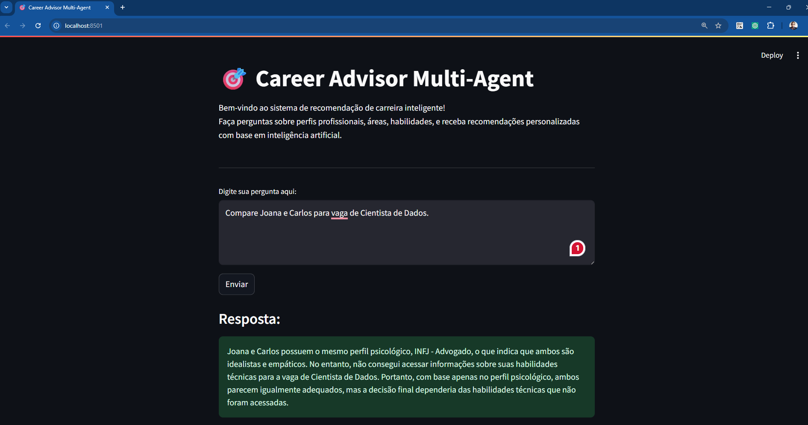

# 💼 career-advisor-multi-agent

Sistema inteligente que recomenda carreiras ideais com base em **habilidades técnicas**, **experiências profissionais**, **interesses pessoais** e **perfil psicológico**, utilizando **LangChain**, **OpenAI GPT-4o** e **multi-agentes**.



## 🧠 Visão Geral

Este projeto usa uma arquitetura orientada a agentes para simular um processo de aconselhamento profissional. A IA analisa dados do candidato (armazenados em `.csv`) e sugere áreas e cargos ideais, cruzando habilidades, experiências e perfis com oportunidades disponíveis.


## Funcionalidades do Agente de Carreira IA

O AgenteCarreiraIA é um sistema inteligente projetado para auxiliar usuários em suas decisões de carreira. Ele utiliza uma combinação de ferramentas e um modelo de linguagem grande (LLM) para fornecer insights e recomendações personalizadas. Suas principais funcionalidades incluem:

- Recomendação de Carreiras: Analisa informações fornecidas pelo usuário (interesses, experiências, etc.) para sugerir carreiras que melhor se alinham ao seu perfil.
- Extração de Habilidades Técnicas: Identifica e extrai habilidades técnicas relevantes a partir de descrições de vagas, currículos ou outras fontes de texto.
- Avaliação de Perfil Psicológico: Avalia o perfil psicológico do usuário para entender suas características de personalidade, seus valores e suas preferências de trabalho, auxiliando na escolha de carreiras mais adequadas.
- Consulta de Oportunidades: Acessa e apresenta informações sobre diversas oportunidades de carreira disponíveis, como vagas de emprego e programas educacionais.


O agente utiliza um fluxo de trabalho orquestrado pelo modelo de linguagem gpt-4o. Ao receber uma pergunta do usuário, o agente decide qual ferramenta utilizar para responder da melhor forma possível, podendo inclusive combinar o uso de múltiplas ferramentas para fornecer uma resposta abrangente.


## 🛠️ Tecnologias Utilizadas

* Python 3.10+
* [LangChain](https://www.langchain.com/)
* [OpenAI GPT-4o](https://platform.openai.com/docs/models/gpt-4o)
* Streamlit (versão com front-end)
* python-dotenv
* pandas

---

## 📁 Estrutura do Projeto

```
career-advisor-multi-agent/
│
├── .env                       # Chaves de API (OpenAI)
├── README.md
├── main.py                    # Execução principal via CLI
├── streamlit_app.py           # Interface web com Streamlit
│
├── agente.py                  # Montagem do agente principal
├── carreira.py                # Ferramenta de recomendação de carreira
├── habilidades.py             # Ferramenta de leitura de habilidades
├── psicologia.py              # Ferramenta de leitura de perfil psicológico
├── oportunidades.py           # Ferramenta de leitura de vagas
│
├── documentos/
│   ├── candidatos.csv         # Dados dos candidatos
│   └── oportunidades.csv      # Banco de oportunidades/vagas
```

---

## 🔐 Configuração do Ambiente

Crie um arquivo `.env` na raiz do projeto com o seguinte conteúdo:

```env
OPENAI_API_KEY=sk-xxxxxxxxxxxxxxxxxxxx
```

---

## 📦 Instalação

1. Clone o repositório:

```bash
git clone https://github.com/seu-usuario/career-advisor-multi-agent.git
cd career-advisor-multi-agent
```

2. Crie e ative um ambiente virtual:

```bash
python -m venv venv
source venv/bin/activate      # Linux/macOS
venv\Scripts\activate         # Windows
```

3. Instale as dependências:

```bash
pip install -r requirements.txt
```

---

## ▶️ Como Executar

### Modo 1: Linha de Comando (CLI)

```bash
python main.py
```

Você poderá fazer perguntas como:

* "Qual carreira ideal para Joana?"
* "Carlos é melhor para marketing ou produto?"
* "Compare Joana e Carlos para vaga de Cientista de Dados."

---

### Modo 2: Interface Web com Streamlit

```bash
streamlit run streamlit_app.py
```

A interface será aberta no navegador. Você poderá interagir com o sistema, selecionando candidatos e recebendo recomendações visuais de carreira de forma intuitiva e atraente.

---

## 🧪 Dados de Exemplo

### `documentos/candidatos.csv`

```csv
NOME,HABILIDADES,EXPERIENCIAS,INTERESSES,TESTE_PSI
Joana,"Python,SQL,Análise","2 anos como Analista","Dados,Ensino","INFJ"
Carlos,"Design,UX,Adobe","1 ano como Estagiário","Criação,Produtos","ENFP"
```

### `documentos/oportunidades.csv`

```csv
CARGO,AREA,REQUISITOS,PESO_INTERESSE,PESO_HABILIDADES
Cientista de Dados,TI,"Python,SQL",0.4,0.6
UX Designer,Design,"UX,Adobe",0.5,0.5
```

---

## 🤖 Como Funciona

1. **Ferramentas (Tools)** carregam dados e regras de negócios a partir dos CSVs.
2. O **agente LangChain** é configurado para usar essas ferramentas e raciocinar com base nos dados.
3. A pergunta do usuário é processada pelo agente, que consulta as ferramentas e retorna uma resposta contextualizada e personalizada.

---

## ✅ Funcionalidades

* Recomendações de carreira personalizadas para candidatos
* Suporte para múltiplos candidatos e vagas
* Duas formas de interação: linha de comando e interface web moderna (Streamlit)
* Explicações baseadas em perfis psicológicos e habilidades técnicas
* Arquitetura modular e fácil de estender

---

## 📌 Melhorias Futuras

* Integração com APIs reais de vagas (LinkedIn, Glassdoor, etc.)
* Chatbot em tempo real com memória de contexto
* Ajuste de pesos e recomendações via aprendizado de máquina
* Dashboard analítico com dados históricos

---

## 📄 Licença

MIT License

---
